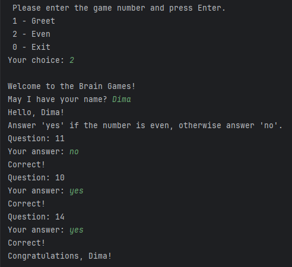
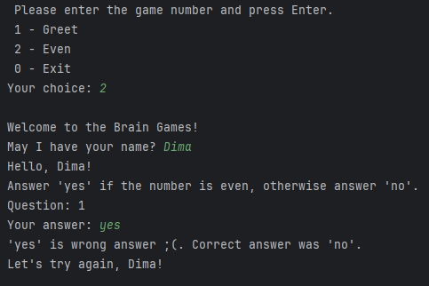
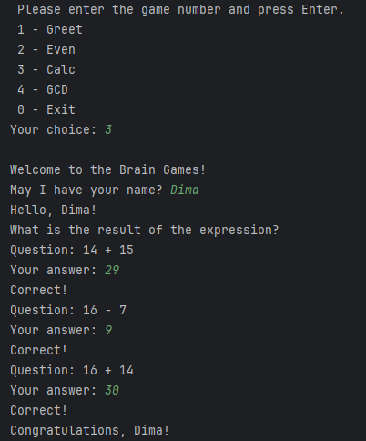
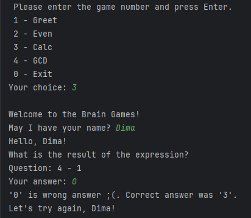
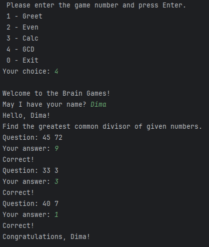
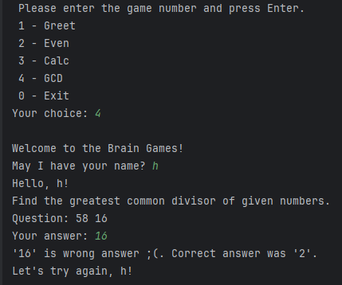

### Hexlet tests and linter status:

### Sonar badges

### Общие правила для игр
Пользователь должен дать правильный ответ на три вопроса подряд, чтобы успешно завершить игру.
* В случае, если пользователь даст неверный ответ, то игра завершается. 
* В случае, если пользователь ввел верный ответ, игра продолжается.

### Игра "Проверка на чётность" (Even)
Суть игры в следующем: пользователю показывается случайное число. И ему нужно ответить yes, если число чётное, или no — если нечётное.

Пример успешной игры:

Пример неуспешной игры:

### Игра "Калькулятор" (Calc)
Суть игры в следующем: пользователю показывается случайное математическое выражение, например 35 + 16, которое нужно вычислить и записать правильный ответ.

Пример успешной игры:

Пример неуспешной игры:

### Игра "НОД" (GCD)
Суть игры в следующем: пользователю показывается два случайных числа, например, 25 50. Пользователь должен вычислить и ввести наибольший общий делитель этих чисел.

Пример успешной игры:

Пример неуспешной игры:

